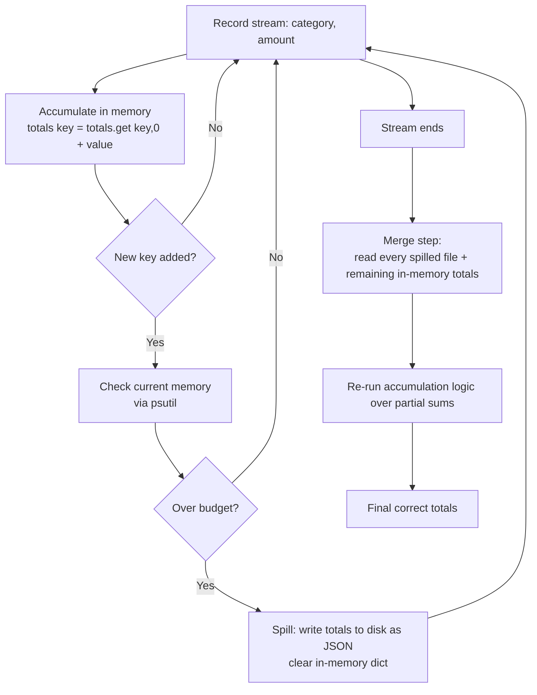

# Spark-Style Spill-to-Disk Simulator

A small Python project that imitates one specific piece of how big-data
engines like Apache Spark handle data that doesn't fit in memory: instead
of loading everything into RAM and crashing when it runs out, the engine
spills excess data to disk, then merges everything back into a correct
final result.

See `DECISIONS.md` for the full design reasoning, including two failed
approaches along the way, and the final benchmark comparison.

## Why this project

This came out of a self-study track through *Computer Systems: A
Programmer's Perspective* (Bryant & O'Hallaron) — Chapters 1, 6, and 9,
covering the memory hierarchy, caching, and virtual memory.

While working through that material, I started studying Apache Spark in
parallel, and ran into the same question from a different angle: how
does Spark run something like a `groupby` over data that's too big to
fit in memory on any single machine? The answer -- spilling the
in-memory accumulator to disk when it grows too large, then merging the
spilled pieces back together -- is a direct, practical application of
exactly what those three chapters cover: the cost difference between RAM
and disk, why that difference matters for anything accumulating state in
memory, and why systems that handle large data deliberately manage that
boundary instead of letting the OS handle it via virtual memory.

Rather than just reading about it, this project builds a small, working
version of that same mechanism, to make the idea concrete instead of
abstract.

## How it works



## What it does

- Generates a stream of `{category, amount}` records with a large number
  of distinct categories.
- Accumulates a running sum per category in memory (`groupby` + `sum`).
- Once the in-memory accumulator's estimated size crosses a configured
  memory budget, spills its current contents to disk as a JSON file and
  clears memory to keep processing.
- After all records are processed, merges every spilled file plus
  whatever's left in memory into one correct final result.
- Compares this against a naive, unbounded version (no spilling) on
  identical input, to verify correctness and measure the memory/runtime
  tradeoff.

## Results (summary)

| N | Version | Peak memory | Runtime | Spills |
|---|---------|-------------|---------|--------|
| 1,000,000 | Naive | 283.5 MB | 0.59 s | — |
| 1,000,000 | Spilling | 239.7 MB | 16.0 s | 1 |
| 5,000,000 | Naive | 1088.2 MB | 3.41 s | — |
| 5,000,000 | Spilling | 650.0 MB | 81.4 s | 7 |

Naive and spilling versions were verified to produce exactly identical
output on the same input. Full reasoning, including two rejected
approaches to the memory-size trigger, is in `DECISIONS.md`.

## Setup

```bash
python3 -m venv venv
source venv/bin/activate
pip install psutil
```

`psutil` is the only external dependency — used to measure current
process memory for the spill trigger (see `DECISIONS.md` for why).
Everything else uses Python's standard library.

## Usage

```bash
python3 src.py
```

Runs both the spilling and naive accumulators at a fixed N, prints peak
memory, runtime, spill count, and a correctness check comparing the two
results.

